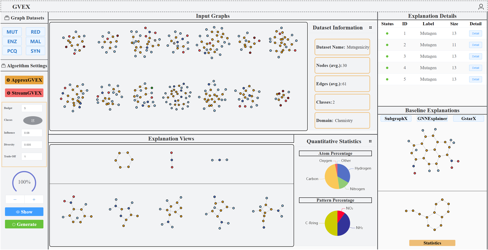
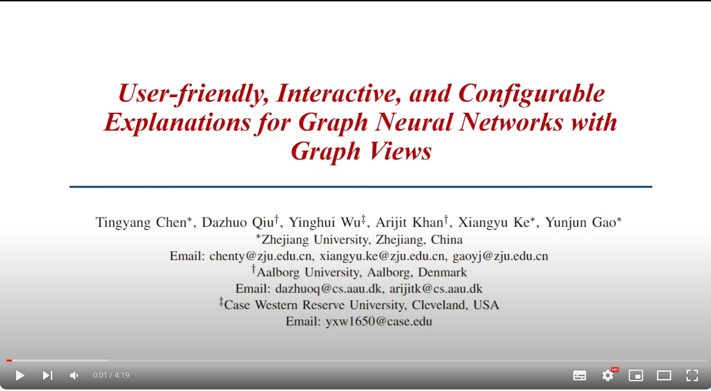

# User-friendly, Interactive, and Configurable Explanations for Graph Neural Networks with Graph Views

This repository contains the source code of the frontend and a portion of the backend code used in our demo paper: 
**User-friendly, Interactive, and Configurable Explanations for Graph Neural Networks with Graph Views**, SIGMOD(demo) 2024, by Tingyang Chen, Dazhuo Qiu, Yinghui Wu, Arijit Khan, Xiangyu Ke, Yunjun Gao

Explaining the behavior of graph neural networks (GNNs) has become critical due to their ``black-box'' nature, especially in the context of analytical tasks such as graph classification. Current approaches are limited to providing explanations for individual instances or specific class labels and may return large explanation structures that are hard to access, nor directly queryable. In this paper, we present **GVEX** (**G**raph **V**iews for GNN **EX**planation) -- our system developed to offer *user-friendly*, *interactive*, and *configurable* explanations for GNNs based on *graph views.* **GVEX** provides a configuration component to enable users to easily select a desired number of important nodes from different classes, thereby generating explanations tailored to multiple classes of interest. Furthermore, **GVEX** generates high-quality explanation subgraphs by identifying important nodes exploiting factual and counterfactual properties and by computing their aggregated influence on the remaining nodes following the GNN message passing paradigm. Lastly, **GVEX** performs a summarization step on top of lower-tier explanation structures to generate higher-tier graph patterns that offer direct access for users with (domain-aware) queries. Our demonstration will highlight **(1)** a novel two-tier explanation structure called *explanation views*, consisting of graph patterns and a set of explanation subgraphs, which provide high-quality explanations for GNNs. **(2)** The system’s intuitive GUI facilitates user interaction to configure personalized settings, e.g., classes of interest and explanation size, and compare with other explanation algorithms; **(3)** **GVEX** generates queryable explanations, making it easy for human experts to access and inspect with domain knowledge. 



# Demo Video

<a href="https://youtu.be/q9d7ldulIuQ" target="_blank"></a>

# Usage

## (1)  front-end

### Recommended IDE Setup

[VSCode](https://code.visualstudio.com/) + [Volar](https://marketplace.visualstudio.com/items?itemName=Vue.volar) (and disable Vetur) + [TypeScript Vue Plugin (Volar)](https://marketplace.visualstudio.com/items?itemName=Vue.vscode-typescript-vue-plugin).

### Project Setup

```sh
npm install
```

### Compile and Hot-Reload for Development

```sh
npm run dev
```

## (2) back-end

```sh
flask run
```

## (3) open the web page

After you deploy the project, you can click [http://127.0.0.1:8080](http://127.0.0.1:8080/).
